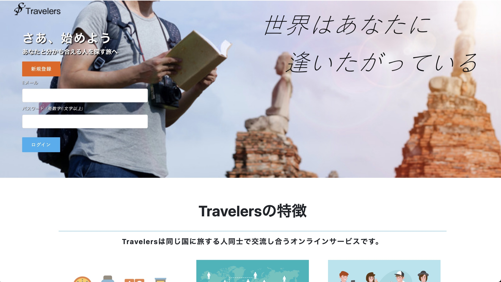

# アプリケーション名
Travelers

# 概要
同じ国に旅する人同士で交流し合うオンライン掲示板サービス

# 本番環境
## URL
http://18.178.165.200/

ログイン情報（テスト用）
- Eメール：test@test.com
- パスワード：abc123

# 制作背景
- 制作意図
初めての海外旅行で同じ日本人と出会い、人見知りな自分でもその人と仲良く慣れたという経験から、海外で同じ国籍の人と交流したいというニーズがあると考えて作成
- ペルソナ
老若男女問わず海外旅行と人と交流するのが好きな人
- ユースケース
初めての海外旅行で知らない土地に不安を覚えている人が、同じく初めての海外旅行を経験している人と行動を共にしたい
バックパッカーとして世界一周旅行している人が現地の同じ国籍の人たちと旅をしながら交流を深めていくために利用する
- 課題解決
海外旅行する上での不安感を取り除く
海外で同じ国籍の人と交流を深めたい

# DEMO
## トップページ

## ユーザー一覧表示

## ユーザー検索

# 工夫したポイント
- 使い勝手の良さ
- 一度交流した人と以降も親交を深めるため、検索精度とマッチング率を上げるための工夫(試行錯誤段階中)

# 使用技術
## バックエンド
Ruby, Ruby on Rails
## フロントエンド
HTML, CSS, JavaScript
## データベース
MySQL, SequelPro
## インフラ
Heroku
## ソース管理
GitHub, GitHubDesktop
## テスト
RSpec
## エディタ
VSCode
# 課題・実装予定機能
- 検索機能の拡張（年齢、国籍、職業etc）
- コメント返信機能
- ユーザー登録をウィザード形式にする

# テーブル設計

## users テーブル

| Column             | Type    | Options     |
| ------------------ | ------- | ----------- |
| name               | string  | null: false |
| email              | string  | null: false |
| password           | string  | null: false |
| encrypted_password | string  | null: false |
| introduction       | text    |             |
| age                | integer |             |
| country_id         | integer | null: false |

### Association

- has_many :room_users
- has_many :rooms, through: room_users
- has_many :talks

## rooms テーブル

| Column | Type   | Options     |
| ------ | ------ | ----------- |
| name   | string | null: false |

### Association

- has_many :room_users
- has_many :users, through: room_users
- has_many :talks

## room_users テーブル

| Column | Type       | Options                        |
| ------ | ---------- | ------------------------------ |
| user   | references | null: false, foreign_key: true |
| room   | references | null: false, foreign_key: true |

### Association

- belongs_to :room
- belongs_to :user

## talks テーブル

| Column  | Type       | Options                        |
| ------- | ---------- | ------------------------------ |
| content | string     |                                |
| user    | references | null: false, foreign_key: true |
| room    | references | null: false, foreign_key: true |

### Association

- belongs_to :room
- belongs_to :user
